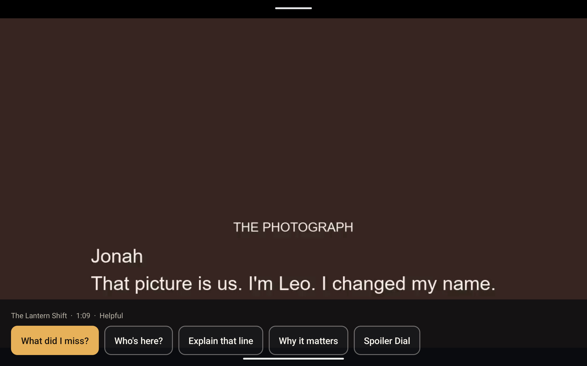

# ContextCue

**Understand what you missed — without rewinding or spoilers.**

ContextCue is a playback-aware comprehension layer for television. While a story plays on Fire TV, a viewer can ask what they missed, who is on screen, or what a line means. The answer is limited to facts that have already been revealed at the current playback time. The same state is available in a simulated Alexa+ conversation.

This project targets the Fire TV and Alexa+ tracks of the 2026 Amazon Developer Hackathon, plus the AWS Builder mini-challenge.



## What is real

- The Fire OS app plays an original short, *The Lantern Shift*, with remote-style focus and context overlays.
- Narrative facts are removed **before** any model call when their reveal time is later than the playback position. Tests cover the boundary, every product operation, and prompts that ask for the ending anyway.
- The Alexa+ screen is a simulation. It is labeled as one. It calls the project's MCP server over Streamable HTTP (protocol 2025-11-25).
- AWS is deployed in `us-west-2`. The API is `https://u3ne3gu6e8.execute-api.us-west-2.amazonaws.com`. It uses Lambda, API Gateway, DynamoDB, and S3. Amazon Nova Lite (`amazon.nova-lite-v1:0`) is the Bedrock model in code. On 2026-10-02 `Converse` was denied while the account was being verified, so answers are a deterministic draft of eligible facts and are labeled `deterministic-fallback`.
- The screenshot above is the Fire OS app on an Android emulator. An Android TV system image is not installed on this machine yet. The hackathon FAQ accepts an Android TV emulator; this run used the available tablet image in landscape.

## Run it

Prerequisites: Node.js 20+, ffmpeg if you regenerate the film, JDK 17, Android SDK for the Fire OS app.

```powershell
npm install
npm run ingest
npm test
npm run dev
```

The API and MCP server listen on `http://127.0.0.1:8787`.

In another terminal:

```powershell
npm install --prefix apps/alexa-sim
npm run dev --prefix apps/alexa-sim
```

Open `http://127.0.0.1:5173`. The page says it is a simulated Alexa+ experience.

Fire OS app:

```powershell
cd apps/firetv
# local.properties must set sdk.dir to your Android SDK
.\gradlew.bat :app:assembleDebug
```

The emulator reaches the API at `http://10.0.2.2:8787`. Install the debug APK on an Android TV emulator. The hackathon FAQ accepts that emulator for the Fire TV track.

AWS:

```powershell
cd infra
npm install
npm test
npx cdk bootstrap
npm run deploy
```

Copy `.env.example` to `.env`. Leave `BEDROCK_MODEL_ID` unset until `npm run bedrock:check` prints `bedrock ok`. Then set `BEDROCK_MODEL_ID=amazon.nova-lite-v1:0`.

## Spoiler safety

Every fact has `revealedAtMs`. For playback time `T`, only facts with `revealedAtMs <= T` can be selected. Strict, Helpful, and Catch Me Up change how much eligible context is used. None of them can see the later reveal. In *The Lantern Shift*, Jonah's identity is revealed at 56 seconds and has leak guards that tests search for in earlier answers.

The filter is in `src/domain/engine.ts`. The checks are in `src/domain/engine.test.ts`, `evals/golden.test.ts`, and `src/mcp/contract.test.ts`.

## Layout

- `src/domain` — temporal filter and grounded answers
- `src/runtime` — preferences, playback, Bedrock client, DynamoDB store
- `src/mcp` — Streamable HTTP MCP tools
- `src/orchestrator` — Alexa+ simulation intents
- `apps/firetv` — Fire OS player
- `apps/alexa-sim` — simulated Alexa+ experience
- `infra` — CDK stack
- `demo/the-lantern-shift` — original film, captions, and timeline
- `ContextCue_AI_SDLC_Pack` — product and hackathon notes

## License

MIT. *The Lantern Shift* was created for this project and can be shown in the submission.
